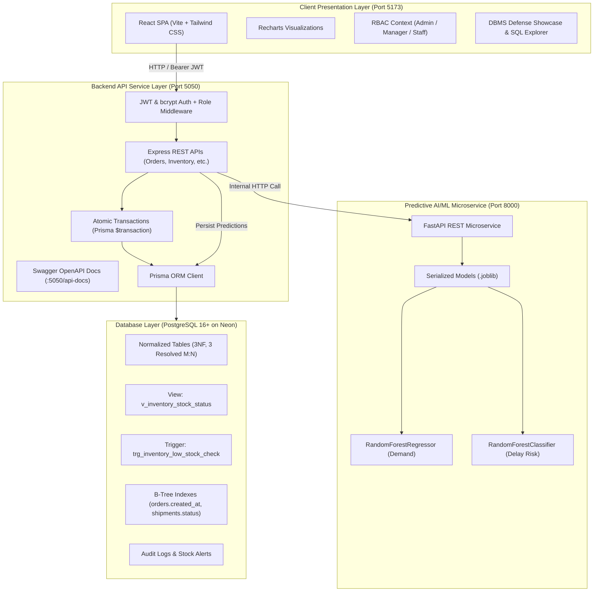

# AI-Driven Smart Logistics & Predictive Supply Chain Management System

A role-based, multi-user enterprise logistics platform engineered as a **DBMS Project-Based Learning (PBL)** deliverable. The system showcases a strictly normalized PostgreSQL relational schema (Third Normal Form), automated database triggers, database views, atomic ACID transactions with rollback guarantees, and performance B-Tree indexing, enhanced with an offline-trained Scikit-learn machine learning microservice for predictive demand forecasting and shipment delay risk classification.

---

## 1. System Architecture



---

## 2. Technology Stack

| Layer | Technology | Purpose |
|---|---|---|
| **Frontend** | React 18 (Vite) + Tailwind CSS + Axios + React Router | High-performance responsive supply chain dashboard |
| **Data Visualization** | Recharts | Native React area charts, bar charts, and forecasting curves |
| **Backend API** | Node.js + Express.js + TypeScript | RESTful API with modular route controllers and security headers |
| **ORM** | Prisma ORM | Type-safe queries, relational schema migrations, and transactions |
| **Database** | PostgreSQL 16+ (Neon Serverless) | 3NF normalized schema, triggers, views, constraints, indexes |
| **Authentication & RBAC** | JWT (`jsonwebtoken`) + `bcryptjs` | Multi-user role-based route guards (`ADMIN`, `MANAGER`, `STAFF`) |
| **Validation** | Zod | Strong schema validation for all HTTP payloads |
| **AI/ML Service** | Python 3.14 + FastAPI + Uvicorn | Stateless microservice serving pre-trained Scikit-learn pipelines |
| **ML Algorithms** | `RandomForestRegressor` + `RandomForestClassifier` | Offline-trained demand forecasting ($R^2=0.938$) & delay risk scoring |
| **Model Persistence** | `joblib` | Fast model binary serialization/deserialization on startup |
| **API Documentation** | `swagger-jsdoc` + `swagger-ui-express` | Interactive OpenAPI documentation at `/api-docs` |

---

## 3. Database Design & Relational Engineering (Core Deliverable)

### 3.1 Third Normal Form (3NF) Normalization Breakdown
1. **1NF**: Every field is atomic; repeating groups are eliminated. Multiple products per order are normalized into `order_items`. Multiple suppliers per product are normalized into `product_suppliers`.
2. **2NF**: In 1NF, and all non-key attributes are fully functionally dependent on primary/composite keys. For bridge tables like `product_suppliers(product_id, supplier_id)`, `supply_price` depends on both foreign keys simultaneously.
3. **3NF**: In 2NF, and no transitive functional dependencies exist ($X \rightarrow Y$ and $Y \rightarrow Z$). Roles are isolated in `roles`, routes in `routes`, and warehouses in `warehouses`.

### 3.2 Resolved Many-to-Many Relationships
- **Product ↔ Supplier**: Resolved by bridge table `product_suppliers` (stores `supply_price`, `supplier_sku`, `is_primary`).
- **Product ↔ Warehouse**: Resolved by bridge table `inventory` (stores `quantity`, `reorder_threshold`, `max_capacity`).
- **Order ↔ Product**: Resolved by bridge table `order_items` (stores `warehouse_id`, `quantity`, `unit_price`, `subtotal`).

### 3.3 Advanced DBMS Features

#### 1. PostgreSQL View: `v_inventory_stock_status`
```sql
CREATE OR REPLACE VIEW v_inventory_stock_status AS
SELECT 
    i.id AS inventory_id,
    p.id AS product_id,
    p.sku,
    p.name AS product_name,
    p.category,
    p.unit_price,
    p.unit_cost,
    w.id AS warehouse_id,
    w.code AS warehouse_code,
    w.name AS warehouse_name,
    w.city AS warehouse_city,
    i.quantity,
    i.reorder_threshold,
    i.max_capacity,
    ROUND((p.unit_price * i.quantity)::numeric, 2) AS total_retail_value,
    CASE 
        WHEN i.quantity = 0 THEN 'OUT_OF_STOCK'
        WHEN i.quantity <= i.reorder_threshold THEN 'LOW_STOCK'
        WHEN i.quantity >= (i.max_capacity * 0.9) THEN 'OVERSTOCKED'
        ELSE 'OPTIMAL'
    END AS stock_health_status,
    i.updated_at AS last_updated_at
FROM inventory i
JOIN products p ON i.product_id = p.id
JOIN warehouses w ON i.warehouse_id = w.id;
```

#### 2. PostgreSQL Trigger: `trg_inventory_low_stock_check`
Automatically monitors inventory mutations and inserts a warning record into `stock_alerts` when quantity drops to or below the reorder threshold:
```sql
CREATE OR REPLACE FUNCTION fn_check_inventory_alert()
RETURNS TRIGGER AS $$
BEGIN
    IF NEW.quantity <= NEW.reorder_threshold THEN
        INSERT INTO stock_alerts (
            product_id, warehouse_id, alert_type, current_quantity, threshold, is_resolved, created_at
        ) VALUES (
            NEW.product_id, NEW.warehouse_id,
            CASE WHEN NEW.quantity = 0 THEN 'OUT_OF_STOCK' ELSE 'LOW_STOCK' END,
            NEW.quantity, NEW.reorder_threshold, FALSE, NOW()
        );
    END IF;
    RETURN NEW;
END;
$$ LANGUAGE plpgsql;

CREATE TRIGGER trg_inventory_low_stock_check
AFTER UPDATE OF quantity OR INSERT ON inventory
FOR EACH ROW EXECUTE FUNCTION fn_check_inventory_alert();
```

#### 3. Atomic Transaction with Rollback Guarantee (`$transaction`)
Implemented in `POST /api/orders`:
- Verifies and locks stock in the origin warehouse.
- If requested quantity exceeds stock, **aborts and triggers an immediate database rollback** (zero rows persisted).
- If sufficient: atomically inserts the order, creates line items, decrements inventory, provisions the shipment route, and logs an audit record.

#### 4. B-Tree Indexes & Query Execution Plans
- `orders(created_at DESC)`: Optimizes time-range and monthly revenue trend grouping.
- `shipments(status)`: Optimizes dispatcher filtering for active/delayed cargo.
- Verified live via `EXPLAIN (ANALYZE, BUFFERS)` in the DBMS Showcase tab.

---

## 4. Machine Learning Service Architecture

The AI/ML microservice adheres to strict production design principles:
- **Stateless Inference**: FastAPI has zero awareness of application users or sessions.
- **Offline Training**: Models are trained offline via `ml_service/app/train.py`, validated against held-out test splits, and serialized to `.joblib` files in `ml_service/saved_models/`.
- **Startup Memory Loading**: The `.joblib` artifacts are loaded into RAM once during FastAPI startup.
- **Persistent Predictions**: Express calls FastAPI, then **persists the prediction into PostgreSQL** (`demand_forecasts` and `risk_scores`), preserving a historical audit trail.

---

## 5. Getting Started & Running Locally

### Prerequisites
- Node.js `v18+` (or `v20+` / `v26+`)
- Python `3.10+` (or `3.14+`)
- Free PostgreSQL instance (Neon / Supabase or local PostgreSQL)

### Step 1: Start Python FastAPI ML Microservice (Port 8000)
```bash
cd ml_service
source venv/bin/activate
uvicorn app.main:app --host 127.0.0.1 --port 8000
```
*Health check verified at `http://127.0.0.1:8000/health`*

### Step 2: Start Express.js Backend (Port 5050)
```bash
cd backend
npm install
npx prisma db push
npx tsx prisma/init_db.ts
npx tsx prisma/seed.ts
npm run dev
```
*Interactive Swagger API documentation available at `http://localhost:5050/api-docs`*

### Step 3: Start React Vite Frontend (Port 5173)
```bash
cd frontend
npm install
npm run dev
```
*Access dashboard in browser at `http://localhost:5173`*

---

## 6. Examiner & Live Viva Demo Accounts

Use the **1-Click Demo Buttons** on the Login screen to switch between roles instantly:

| Role | Email | Password | Permissions & Visibility |
|---|---|---|---|
| **ADMIN** | `admin@logistics.com` | `admin123` | Full access, user promotion, supplier editing, system audit logs |
| **MANAGER** | `manager@logistics.com` | `manager123` | Order approval, inventory transfer, demand forecasting |
| **STAFF** | `staff@logistics.com` | `staff123` | Operational order entry, stock view, shipment milestone logging |

---

## 7. Recommended Viva Defense Demonstration Flow

1. **RBAC Demonstration**: Log in as `Admin`, show role badge and initials avatar in the header. Use the 1-click header switcher to switch to `Staff` and demonstrate route-level access control.
2. **PostgreSQL View Verification**: Navigate to **Smart Inventory** $\rightarrow$ switch to the **PostgreSQL View** tab. Show how `v_inventory_stock_status` computes real-time retail valuation and stock health badges directly in SQL.
3. **Atomic Transaction & Live Order Placement**: Open **Orders & Fulfillment** $\rightarrow$ click **Place New Order**. Place an order for 5 units $\rightarrow$ show how the inventory is decremented atomically in the database and a shipment is auto-generated.
4. **DBMS Defense Showcase Tab**: Open the **DBMS Showcase** tab:
   - Click **Test Trigger Execution Live** $\rightarrow$ shows the PostgreSQL trigger `trg_inventory_low_stock_check` inserting an alert into `stock_alerts`.
   - Click **Simulate Failed Transaction** $\rightarrow$ demonstrates transaction rollback with zero ghost records.
   - Click **Run Live EXPLAIN ANALYZE** $\rightarrow$ displays the query execution plan proving B-Tree index utilization.
5. **AI Demand Forecasting**: Open **AI Demand Forecasting** $\rightarrow$ click **Run ML Forecast** to show real-time inference via FastAPI persisting into `demand_forecasts`.

