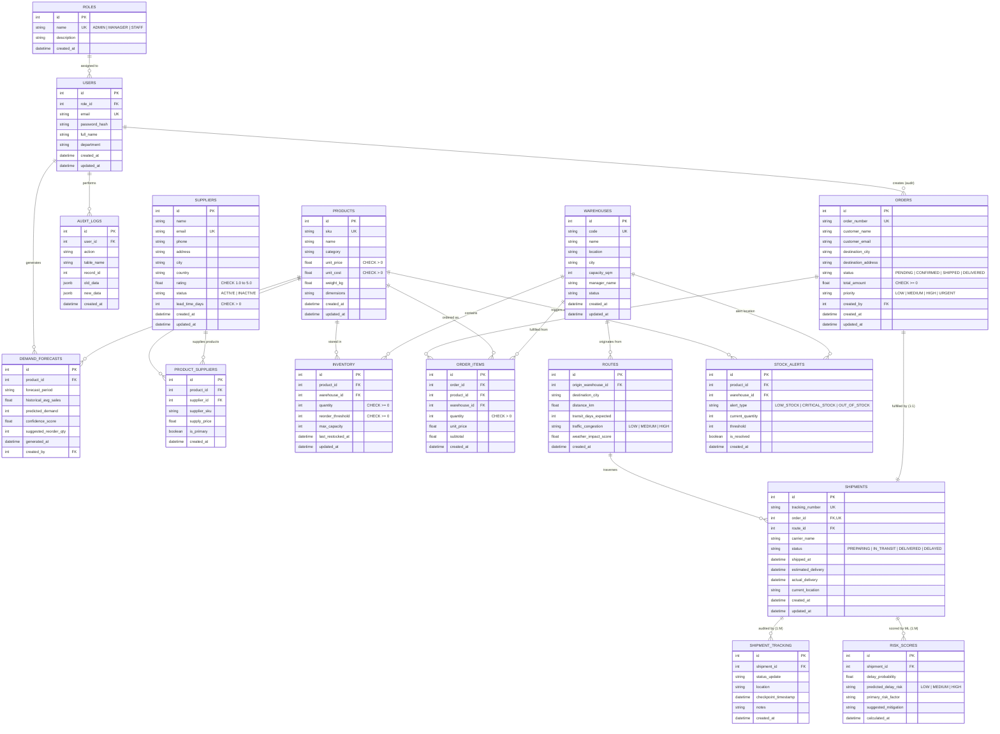

# Entity-Relationship (ER) Diagram & Normalization Analysis

**System**: AI-Driven Smart Logistics & Predictive Supply Chain Management System  
**Target RDBMS**: PostgreSQL 16+ (Hosted on Neon Serverless)  
**ORM**: Prisma  

---

## 1. Relational ER Diagram (Crow's Foot Notation)

---

## 2. Relational Normalization Proof (1NF to 3NF)

### 2.1 First Normal Form (1NF)
- **Rule**: Each column contains atomic (indivisible) values, and there are no repeating groups or multi-valued attributes.
- **Application**:
  - In legacy designs, an order table often had columns like `item_1`, `item_2`, `item_3` or a comma-separated list of product IDs.
  - In our schema, line items are normalized into `order_items`, with exactly one product per tuple.
  - Multi-supplier products are separated into `product_suppliers`.
  - Checkpoint tracking events are normalized into `shipment_tracking` rather than JSON arrays.

### 2.2 Second Normal Form (2NF)
- **Rule**: The relation is in 1NF and every non-prime attribute is fully functionally dependent on the primary key (no partial dependencies on composite keys).
- **Application**:
  - In `product_suppliers`, candidate key is `(product_id, supplier_id)`. The non-key attributes `supply_price`, `supplier_sku`, and `is_primary` depend strictly on both the product and supplier simultaneously. Product names and supplier addresses are kept in their respective parent tables (`products` and `suppliers`) to prevent partial functional dependency.
  - In `inventory`, candidate key is `(product_id, warehouse_id)`. Non-key attributes `quantity` and `reorder_threshold` depend on the specific product at that specific warehouse.

### 2.3 Third Normal Form (3NF)
- **Rule**: The relation is in 2NF and no non-prime attribute is transitively dependent on the primary key ($X \rightarrow Y$ and $Y \rightarrow Z$ where $Z$ is non-prime).
- **Application**:
  - In `orders`, the customer information has `destination_city`, but warehouse capacity and address are NOT stored on the order; they are linked via `warehouse_id` in `order_items`.
  - In `shipments`, the route distance and congestion are not duplicated; they reside in `routes`, linked via `route_id`.
  - In `users`, roles are normalized out to `roles`, preventing transitive dependency ($User \rightarrow RoleName \rightarrow RolePermissions$).

---

## 3. Resolution of Many-to-Many Relationships

| Relationship | Entity 1 | Entity 2 | Bridge Table | Key Attributes in Bridge |
|---|---|---|---|---|
| **Product ↔ Supplier** | `products` | `suppliers` | `product_suppliers` | `supply_price`, `supplier_sku`, `is_primary` |
| **Product ↔ Warehouse** | `products` | `warehouses` | `inventory` | `quantity`, `reorder_threshold`, `max_capacity` |
| **Order ↔ Product** | `orders` | `products` | `order_items` | `warehouse_id`, `quantity`, `unit_price`, `subtotal` |

